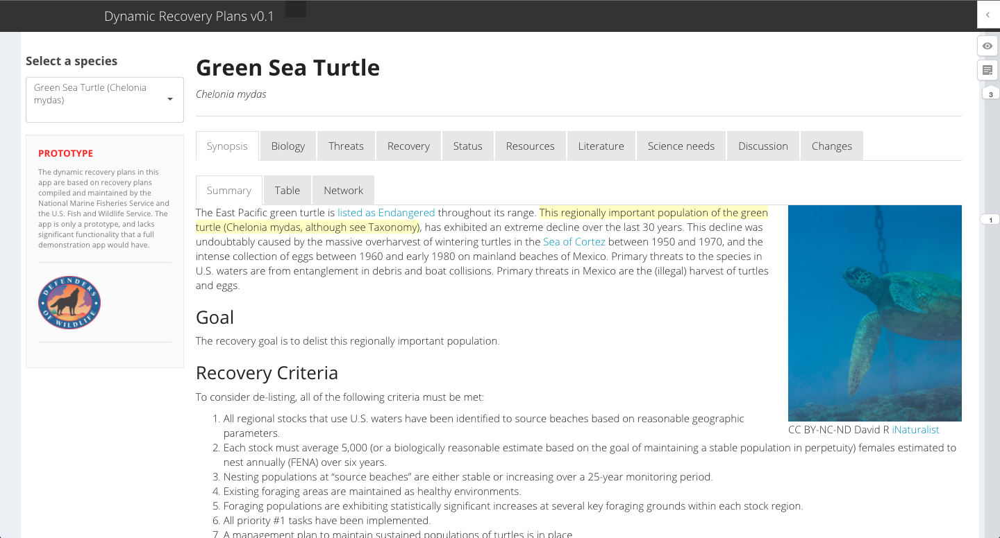
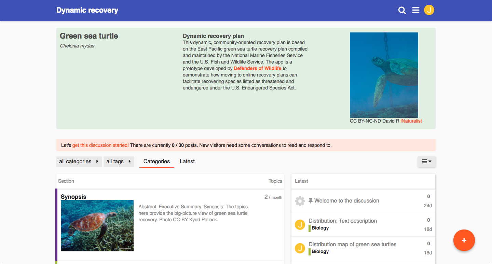

# Dynamic Recovery Plans

The [U.S. Endangered Species Act](http://www.nmfs.noaa.gov/pr/laws/esa/text.htm) 
directs the Fish and Wildlife Service ([FWS](http://www.fws.gov)) and the 
National Marine Fisheries Service ([NMFS](http://www.nmfs.noaa.gov)) to develop 
plans that guide the recovery of threatened and endangered species. 
All recovery plans to-date have been written and published on paper (or as PDFs), 
and have been rarely if ever updated. 
As of October 2016, [half of all recovery plans are 19 years old or older](https://defend-esc-dev.org/working_papers/recovery_plan_analysis.html). 
These out-of-date, non-interactive plans limit recovery and limit our 
(collective) ability to integrate other regulatory aspects of the ESA, such as 
section 7 consultation, with recovery. FWS and NMFS recognize the need to update 
how recovery planning is done. 

[Defenders of Wildlife](http://www.defenders.org) has been developing a variety 
of alternative approaches and platforms to modernize recovery plans.
Each prototype is, at this time, based on the [green sea turtle recovery plan](http://www.nmfs.noaa.gov/pr/pdfs/recovery/turtle_green_eastpacific.pdf); 
below we briefly discuss and link to these alternatives. 
We have also written up a [brief analysis](https://docs.google.com/document/d/1Z4l63uCoRxLOpHh1EdiPi1MCrx-dsak7Cl8rx7PVmwY/edit?usp=sharing) 
of the strengths and weaknesses of these different dynamic recovery plan types.
[We welcome feedback](mailto:esa@defenders.org) on these prototypes!

----

 

<!--- Google_Docs_version -->

<h4><a href="https://docs.google.com/document/d/1P6ro-E2ddDBfWv-ENv7pKMS3iQ978lQZxlon-ozC798/edit#heading=h.pey1zgnfxb24" style="color:white" target="_blank">Google Docs Version</a></h4>

A dynamic recovery plan written using [Google Docs](http://shiny.rstudio.com/). 
The layout looks like a 'normal' document, but can be rapidly updated and can
link directly to external resources. 

__PROS__

- App development and maintenance by Google; both FWS and NMFS already use GSuite
- Security, sharing, collaboration, and most other features already integrated

__CONS__

- Not as flashy as some other options
- No graph embedding (live links are suitable)

<!--- END_GDOC_VERSION -->

<!--- Shiny_version -->

<h4><a href="https://defend-esc-dev.org/shiny/open/dynamic-recovery/" target="_blank">Shiny App Version</a></h4>

An _early prototype_ dynamic recovery plan written using [Shiny](http://shiny.rstudio.com/)
for [R](https://cran.r-project.org/). The layout is somewhat Wikipedia-esque,
with tabs running along the top of the page. This prototype is a shell of a 
recovery plan: extensive 'back-end' work would need to be done to make this 
plan type fully functional.

__PROS__

- Novel interface for recovery plans
- Data-driven figures and tables integrate directly with the plan

__CONS__

- Considerably higher development costs (see intro blurb)
- Steeper learning curve for editing (once developed)

<!--- END_SHINY_VERSION -->

<!--- Discourse_version -->

<h4><a href="https://discourse.defend-esc-dev.org/" target="_blank">Discourse Version</a></h4>

A dynamic recovery plan built using [Discourse](http://discourse.org), which is
a modern discussion board platform for "civilized discussion."
The layout is driven by categories and the time when edits are made, i.e., is 
different than what many people may be used to.

__PROS__

- Novel, community-centric platform for recovery plans
- Fully developed, including security and editing tools

__CONS__

- Unfamiliar user interface, steeper learning curve for editing
- Graph embedding by `iframes`, but not direct

<!--- END_DISCOURSE_VERSION -->

<!--- GitBook_version -->

<h4><a href="https://www.gitbook.com/book/jacob-ogre/gst_recovery/details" target="_blank">GitBook Version</a></h4>

A dynamic recovery plan built using [GitBook](http://www.gitbook.com).
The layout is very "book-like," organized into chapters and sections, paginated.
Content version control with [git](https://git-scm.com/).

__PROS__

- Somewhat familiar book-like interface
- Fully developed, including security and editing tools

__CONS__

- Unfamiliar user interface for editing and version control
- Graph embedding by `iframes`, but not direct

<!--- END_GITBOOK_VERSION -->

Contents <a href="https://creativecommons.org/licenses/by-nc-sa/3.0/" target="_blank">CC BY-NC-SA</a> <a href="http://www.defenders.org" target="_blank">Defenders of Wildlife, 2016</a>

